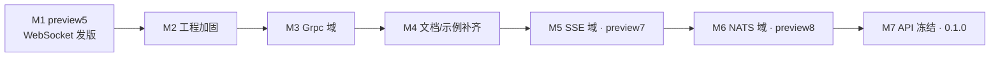

# Observables 路线图

本文件描述 Observables 从预览版走向 **`0.1.0` 稳定版** 的里程碑规划（M1–M7 已全部完成；当前发版目标 **`0.1.7`** = 第九域 Postgres）。它是规划层文档：每个里程碑的工程标准（中央包管理、警告策略、诊断治理等）以 [`AGENTS.md`](../AGENTS.md) 为权威，本文件只排序与拆解。

> 版本号、tag、发版均须维护者明确批准；本文件中的版本号（如 `preview5`）为规划占位，不构成自动发版授权。

## 现状基线（`0.1.7` = Postgres 第九域）

| 维度 | 现状 |
|------|------|
| 已实现域 | **Events**、**RestAPI**、**SignalR**、**Mqtt**、**WebSocket**、**Grpc**、**Sse**、**Nats**、**Postgres**（运行时 + 双路生成器 + 测试） |
| 共享层 | `Observables.Core`、`Observables.SourceGenerators.Shared`、`Observables.CodeFixes`、`Observables.Analyzers` |
| nuget.org | 至 **`0.1.6`** 为 **16 包**；**`0.1.7`** 目标 **18 包**（+ Postgres R3/Reactive；tag/Publish 见维护者步骤） |
| 构建 | 主仓 Nuke `Ci` / `CiPack` / `Publish`；`PackVerify` + `eng/nuget-smoke`（manifest **18** 包） |
| 示例仓 CI | `Observables.Samples` Nuke `Ci`（对齐库版本；Postgres 样例见跨仓 #9） |

### 已知工程债（详见 AGENTS.md「工程治理」）

| # | 项 | 状态 |
|---|-----|------|
| 1 | 中央包管理（`Directory.Packages.props`） | ✅ M2 已落地 |
| 2 | TFM / 公共属性收口（`eng/Observables.ProjectDefaults.props`） | ✅ M2 已落地 |
| 3 | `TreatWarningsAsErrors`；CS860x、IL trim、xUnit 告警 | ✅ M2/M7 已落地（域运行时 net8/9 通过 Requires* 传播与生成代理保留收敛 IL 告警） |
| 4 | Nuke 清单 / 版本双真相源 | ✅ M2 已落地（`Observables.BuildManifest.json` + `PackageVersionReader`） |
| 5 | 诊断 release 跟踪（`AnalyzerReleases.*.md`、移除 RS2008） | ✅ M2 已落地；描述符结构已收敛（Events OBS2xxx 移入域 shproj，OBS*007 保留集中式分析器） |
| 6 | Grpc 骨架命名（`Observables.Grpc.R3`）违反约定 | ✅ M3 已重命名为 `*.R3.SourceGenerators` |
| 7 | 文档滞后：README / Docs / Samples | ✅ M4 已补齐（含 Grpc 用户文档与 Samples） |
| 8 | Samples `RestAPI.Reactive` 显式 `R3` 触发 OBS0001 | ✅ `R3` 改为 runtime-only（`ExcludeAssets=compile`） |
| 9 | Public API 基线（`PublicAPI.Shipped.txt`） | ✅ M7 已落地（7 域 × 2 项目 × 3 TFM = 84 文件） |
| 10 | 源生成器质量加固（关键字冲突 / 异常 fail-safe / 诊断描述符 / auto-generated 标记 / 测试覆盖） | 见 P3 段（E1–E13） |

## 诊断 ID 段分配（权威）

| 段 | 域 | 状态 |
|----|----|------|
| `OBS0001` | Shared（包冲突等全库诊断） | 使用中 |
| `OBS2001`–`OBS2999` | Events | 使用中（2001–2005；2005 为内部 fail-safe） |
| `OBS3001`–`OBS3999` | RestAPI | 使用中（3001–3007；3006 为内部 fail-safe） |
| `OBS4001`–`OBS4999` | SignalR | 使用中（4001–4008；4008 为内部 fail-safe） |
| `OBS5001`–`OBS5999` | Mqtt | 使用中（5001–5008；5008 为内部 fail-safe） |
| `OBS6001`–`OBS6999` | WebSocket | 使用中（6001–6008；6008 为内部 fail-safe） |
| `OBS7001`–`OBS7999` | Grpc | 使用中（7001–7008；7008 为内部 fail-safe） |
| `OBS8001`–`OBS8999` | SSE | 使用中（8001–8007；8006 为内部 fail-safe） |
| `OBS9001`–`OBS9999` | NATS | 使用中（9001–9008；9008 为内部 fail-safe） |
| `OBS10001`–`OBS10999` | Postgres | 使用中（10001–10008；10008 为内部 fail-safe；10007 为空接口，Shared Analyzer） |

当前共 **68** 个唯一诊断（含 Postgres OBS10xxx）：前八域 **60** 个 + Postgres **8** 个。新增诊断须落入对应段并在 `AnalyzerReleases.Unshipped.md` 登记（见 AGENTS.md）。

## 里程碑

里程碑按依赖排序；M1 与 M2 可并行启动。**策略：先扩域、后冻结 1.0** —— 在 `0.1.x` 预览期内先把 SSE（M5）与 NATS（M6）补齐为完整域，待目标域全部就位后再一次性冻结公共 API 并发 1.0（M7）。M7 的 API 冻结依赖 M1–M6 全部完成。

### M1 — `preview5`：WebSocket 发版 ✅

已于 `v0.1.0-preview5` tag 发布至 nuget.org 与 GitHub Packages。

- ~~发布 `Observables.WebSocket.R3` 与 `Observables.WebSocket.Reactive`（共 **10 包**）。~~ ✅
- ~~同步主仓 [`README.md`](../README.md) 域状态表与预览包清单。~~ ✅
- ~~新增 Docs `websocket.md`（中英），来源参考 [`docs/design/websocket.md`](design/websocket.md)。~~ ✅
- ~~新增 Samples `Observables.Samples.WebSocket`。~~ ✅
- ~~出口校验：`Ci` + `CiPack` 绿、WebSocket smoke 消费者通过。~~ ✅

### M2 — 工程加固 ✅

把上文「已知工程债 1–5」收敛到 AGENTS.md 定义的标准态。每条作为独立 PR：

- ~~引入 `Directory.Packages.props`~~ ✅
- ~~`eng/Observables.ProjectDefaults.props` 收口 TFM / 公共属性~~ ✅
- ~~`eng/Observables.BuildManifest.json` + `PackageVersionReader`~~ ✅
- ~~`AnalyzerReleases.Shipped.md` / `Unshipped.md`，移除 RS2008 pragma~~ ✅
- ~~`TreatWarningsAsErrors` + CS86xx / xUnit1051 清零~~ ✅；域运行时 net8/9 IL trim 告警通过 Requires* 传播与 `DynamicDependency` 生成代理保留收敛（M7）。

### M3 — Grpc 域 ✅

按 AGENTS.md「新增 Feature 检查清单」从骨架建成完整域（PR #77，已合并 `main`）：

- ~~新增设计文档 `docs/design/grpc.md`（unary / server-streaming / 双向流到反应式流的映射）。~~ ✅
- ~~重命名骨架：`Observables.Grpc.R3` → `Observables.Grpc.R3.SourceGenerators`，补 `Observables.Grpc.Reactive.SourceGenerators`、`Observables.Grpc.SourceGenerators.Shared`。~~ ✅
- ~~启用 `OBS7xxx` 诊断段（7001–7007）。~~ ✅
- ~~建 `Observables.Grpc.Package`，产出 `Observables.Grpc.R3` / `Observables.Grpc.Reactive` 两包。~~ ✅
- ~~补生成器测试 + E2E + smoke 消费者，纳入 `PackVerify`（manifest **12 包**）。~~ ✅

Grpc 两包已于 **`0.1.0`**（`v0.1.0-preview6` tag）发布至 nuget.org 与 GitHub Packages。

### M4 — 文档与示例补齐 ✅

- ~~统一诊断登记文档（OBS0001 / 2xxx–7xxx）到 Docs `diagnostics.md`~~ ✅
- ~~Docs（中英）`grpc.md`；Samples `Observables.Samples.Grpc`~~ ✅
- ~~校验 README、Docs、Samples 三处域状态与 `0.1.0` 一致~~ ✅
- ~~发版后复核 nuget.org 包页链接与站点 `npm run docs:build`~~ ✅（M4 收尾 PR）

### M5 — SSE 域（`preview7`） ✅

**目标**：补全「HTTP 单向流」边界（RestAPI 为 req/resp、WebSocket 为双工，SSE 居中）。形态为纯消费流，是 `IObservable` 的典型场景；接口面与 SignalR 的 `[HubOn]` 同构，工程骨架以 **WebSocket 域**为模板。

按 AGENTS.md「新增 Feature 检查清单」从零建成完整域：

- 新增设计文档 `docs/design/sse.md`（`text/event-stream` 解析、重连 / `Last-Event-ID`、事件名路由到反应式流的映射）。
- 建 `Observables.Sse`（运行时，复用 `HttpClient`；解析参考 RestAPI）、`Observables.Sse.SourceGenerators.Shared`、`Observables.Sse.R3.SourceGenerators`、`Observables.Sse.Reactive.SourceGenerators`。
- 公共面草案：`[Sse]` 接口 + `[SseEvent("name")]` 属性 → `Observable<T>` / `IObservable<T>`；入口 `SseService.For<T>(...)`。
- 启用 `OBS8xxx` 诊断段（生成器 8001–8006 + 空代理接口 analyzer `OBS8007`，与各域 `*007` 一致）；在 `ProxyDomainCatalog` 登记 Sse 域。
- 建 `Observables.Sse.Package`，产出 `Observables.Sse.R3` / `Observables.Sse.Reactive` 两包；登记 `eng/Observables.BuildManifest.json`（→ **14 包**）。
- 补生成器测试 + E2E（内嵌 HTTP server 推送事件流）+ smoke 消费者，纳入 `PackVerify`。
- 同步三处文档：README 域状态、Docs（中英）`sse.md` + `diagnostics.md`、Samples `Observables.Samples.Sse`（+ `.Reactive`，RegistrationDemo）。

### M6 — NATS 域（`preview8`） ✅

**目标**：引入 Core NATS subject 代理（Subscribe / Publish / Request-Reply）。结构与 Mqtt 同构；JetStream 仅设计 follow-up。

- 新增设计文档 `docs/design/nats.md` ✅
- 建 `Observables.Nats` 运行时 + Shared/R3/Reactive 生成器 ✅
- 公共面：`[Nats]` + `[NatsSubscribe]` / `[NatsPublish]` / `[NatsRequest]`；`NatsService.For<T>(INatsConnection)` ✅
- 启用 `OBS9xxx`（9001–9007）；`ProxyDomainCatalog` 登记 Nats ✅
- 建 `Observables.Nats.Package`；manifest → **16 包** ✅
- 生成器测试 + E2E（进程内 nats-server）+ smoke 消费者 ✅
- 同步 Docs / Samples / README / AGENTS ✅

> M5/M6 为预览期内的新增域，每个域遵循「发版门槛清单」与「新增 Feature 检查清单」；版本号与 tag 仍须维护者明确批准。

### M7 — API 冻结与 `0.1.0` ✅

> 依赖 M1–M6 全部完成（八域齐备后再冻结）。

- 引入 `Microsoft.CodeAnalysis.PublicApiAnalyzers`，为运行时与公共 Attribute 锁定公共 API（`PublicAPI.Shipped.txt` / `Unshipped.txt`）。✅ 见 [`docs/design/public-api.md`](design/public-api.md)。
- nullable / AOT / trim 告警清零（M7 已通过 Requires* 传播与生成代理保留收敛域运行时 IL 告警；`JsonSerializerContext` source-gen 为后续增强）。✅
- 复核包元数据（README、tags、license、SourceLink）。✅
- 维护者推 `v0.1.0` tag → NuGet → GitHub Release（稳定版含 Release，预览版不含）。

## 发版门槛清单（每次 preview / 稳定版）

发布前须全部满足：

1. `dotnet run --project build/_build.csproj -- --target Ci` 通过。
2. `--target CiPack`（含 `PackVerify`）通过，`ExpectedPackageIds` 与实际产物一致。
3. `eng/nuget-smoke` 全部消费者编译/运行通过。
4. `eng/Observables.Package.props` 的 `Version` 与待推 tag 一致（唯一版本来源）。
5. 主仓 README、Observables.Docs、Observables.Samples 三处域状态与版本同步。
6. 预览版仅 tag + NuGet；稳定版额外由维护者建 GitHub Release。

## 版本节奏（规划占位，非授权）

| 版本 | 关联里程碑 |
|------|------------|
| `0.1.0-preview5` | M1（10 包，nuget.org） |
| `0.1.0-preview6` | M3 Grpc 发版（**12 包**，nuget.org） |
| `0.1.0-preview7` | M5 SSE 域（**14 包**） |
| `0.1.0-preview8` | M6 NATS 域（**16 包**） |
| `0.1.0` | M7（八域 API 冻结，**16 包**稳定版） |
| `0.1.1-preview1` | 八域 + Reactive **zh-Hans IntelliSense** 预览 |
| `0.1.1` | 本地化文档稳定版（**16 包**） |
| `0.1.2` | 维护版：Events 增量缓存 + 诊断描述符收敛 + ADR-0001（**16 包**） |
| `0.1.3` | CI 加固：NuGet consumer smoke job + RestAPI 常量统一 + E2E 端口修复 + 符号包配置（未发布，snupkg 空 PDB 被拒） |
| `0.1.4` | 符号包修复：PDB 打入 snupkg（DebugType portable + pack PDBs）（**16 包** + **16 snupkg**） |
| `0.1.5` | 维护版：RestAPI OBS3004 修复（path + [Body]/[Query] 不再误报）+ 全域增量缓存测试（45 测试，8 域 × R3 + Reactive）（**16 包** + **16 snupkg**） |
| `0.1.6-preview1` | 预览版：NuGet 包图标（六边形紫→品红渐变 + Rx 造型，`PackageIcon` 接入）（**16 包** + **16 snupkg**） |
| `0.1.6` | 稳定版：包图标 + C# 关键字标识符转义（6 域）+ 源生成器 fail-safe（E2，OBS* 内部错误诊断）（**16 包** + **16 snupkg**，`v0.1.6` tag + GitHub Release） |
| `0.1.7` | 稳定版：第九域 **Postgres** LISTEN/NOTIFY（**18 包** + **18 snupkg**；OBS10xxx；ADR-002 §6 mid-trigger） |

## Post-1.0 Follow-up（按需，不绑定版本）

以下为 0.1.0 稳定版后的工程改进项，按优先级分组。不阻断发版，维护者有精力时按需处理。

### P1 — 第九域 Postgres（ADR-002）

| # | 行动项 | 状态 | 说明 |
|---|--------|------|------|
| P1-PG | Postgres LISTEN/NOTIFY Feature（主仓） | ✅ 代码落地 | 运行时 + 双路生成器 + Package + E2E（B-tier peer）+ PackVerify / nuget-smoke；设计文档 [`docs/design/postgres.md`](design/postgres.md)；README / CONTRIBUTING / ROADMAP 已同步 |
| P1-PG-nuget | nuget.org 发第九域（+2 包 → 18） | 🔄 `0.1.7` 准备中 | `PackageVersion=0.1.7`；推 `v0.1.7` + Publish + GitHub Release 后勾完成；发版后 ADR-002 §6 mid-trigger |
| P1-PG-docs | Observables.Docs / Samples | 🔄 跨仓收尾 | Docs 去掉 pending；Samples [#9](https://github.com/Skymly/Observables.Samples/issues/9) |

### P2 — 中期处理

| # | 行动项 | 工作量 | 说明 |
|---|--------|--------|------|
| C1 | RestAPI Parser 改用共享 `ObservableReturnTypeParser` | M | **推迟**：RestAPI 返回类型解析有领域特异性（Task/ValueTask/IApiResponse/普通返回），共享 parser 仅处理 Observable/IObservable；~25 行反映领域复杂度非真重复。OBS3003/OBS3005 已有负测，但域内 `RestApiReturnTypeClassifier` 仍是正确 seam（见 `restapi.md` §2.2） |
| ~~C2~~ | ~~RestAPI 粗过滤改 `ForAttributeWithMetadataName`~~ | ~~S~~ | **已评估，决定不实施**：RestAPI 方法级属性模型（`[Get]`/`[Post]` 等）是领域语义决定的，与其他域接口级属性有本质差异；方案 A（6-7 次调用 + merge）复杂度 > 收益，方案 B（强制 `[RestApi]`）破坏性；当前 `CreateSyntaxProvider` 已够用 |
| ~~C3~~ | ~~新建 CHANGELOG.md（Keep a Changelog 格式）~~ | ~~S~~ | **已评估，决定不实施**：已有 GitHub Releases（用户可见）+ CONTRIBUTING.md 版本历史（de facto changelog）+ ROADMAP 版本表；新增 CHANGELOG.md = 第四同步点，每次发版维护负担增加；个人项目 post-1.0 维护期无用户需求 |
| ~~C4~~ | ~~WebSocket/Grpc 设计文档语言对齐为中文~~ | ~~S~~ | **已完成**：websocket.md 与 grpc.md 翻译为中文，对齐 restapi.md/events.md/sse.md/mqtt.md 风格 |
| ~~C6~~ | ~~`release.yml` 验证 tag 与 `eng/Observables.Package.props` 版本一致性~~ | ~~S~~ | **已完成**（0.1.4，`release.yml` 加版本一致性校验步骤） |

### P3 — 源生成器质量加固

基于四维度调研（生成器实现 / 测试覆盖 / 文档体验 / 工程化）的改进项，按优先级分层。不阻断发版，目标为达到优秀源生成器项目的标准态。

#### P3-A — 影响编译正确性（优先）

| # | 行动项 | 工作量 | 说明 |
|---|--------|--------|------|
| ~~E1~~ | ~~C# 关键字冲突处理（7/8 域）~~ | ~~M~~ | **已完成**：共享层新增 `IdentifierHelper.Escape(string)`（基于 `SyntaxFacts.IsKeywordKind`）；SignalR/Mqtt/WebSocket/Grpc/Sse/Nats 6 域 Parser 的 `MemberName`/`ParameterNames`/`ParameterDeclarations` 及 Nats `PayloadParameterName` 统一转义；Mqtt/Nats Emitter 的 Topic/SubjectParameterNames 标识符引用转义；6 域各 1 个关键字快照测试通过 |
| ~~E2~~ | ~~生成器内部异常 fail-safe~~ | ~~M~~ | **已完成**：共享 `GeneratorFailSafe`（`ExecuteParse` / `TryEmit`）；8 域 `OBS*00x/008` 内部错误诊断；SignalR 回归测试（单元 + `IInternalErrorProbe` 集成探针） |

#### P3-B — 影响开发体验与 IDE 集成

| # | 行动项 | 工作量 | 说明 |
|---|--------|--------|------|
| ~~E3~~ | ~~诊断描述符补全 `description` + `helpLinkUri`~~ | ~~S~~ | **已完成**：共享 `DiagnosticHelpLink`；全域 **60** 个唯一 `DiagnosticDescriptor` 补全 `description` 与 `helpLinkUri`（指向 `https://skymly.github.io/Observables.Docs/diagnostics.html#obsxxxx`）；`diagnostics.md` 中英文表加锚点 |
| ~~E4~~ | ~~7/8 域补 `// <auto-generated/>` 标记~~ | ~~S~~ | **已完成**：`GeneratedSourceHeader` 新增 `WritePrefix` / `ToSourceText` 字符串 API；SignalR/Mqtt/WebSocket/Grpc/Sse/Nats/RestAPI 7 域 `Emitter` 统一使用共享头 |
| ~~D1~~ | ~~文档约定（ADR + Design Doc）~~ | ~~M~~ | **已完成**：`DOCUMENTATION.md`（精简版）+ ADR 骨架；`architecture.md` + `contributor.md`；重型 RFC/Spec/Plan/Review 已移除（#117 引入 → 精简） |
| ~~E5~~ | ~~诊断文档补 Fix + 错误→正确代码示例~~ | ~~M~~ | **已完成**：按 **60** 个唯一诊断同步补齐中英文原因、Fix 与错误→正确示例，并标注可用 Code Fix |

#### P3-C — 工程质量增强

| # | 行动项 | 工作量 | 说明 |
|---|--------|--------|------|
| ~~E6~~ | ~~补未测试诊断用例~~ | ~~L~~ | **已完成**：审计 **60** 个描述符；**51/51** 个实际可触发的用户可行动诊断均有负面测试，RestAPI OBS3004 等误报风险分支保留正向回归；8 个内部 fail-safe 仅通过 shared/focused 测试验证。OBS7004 当前无任何报告分支，未伪造生产触发器，留待删除或补语义后再覆盖 |
| ~~E7~~ | ~~测试基础设施去重（15 份 GeneratorTestHarness）~~ | ~~M~~ | **已完成**：在 `Observables.TestSupport` 增加配置驱动的 `GeneratorHarness`、`HarnessDocumentBuilder`、`MetadataReferenceBuilder` 与 Snapshot preset；15 个域测试 Harness 保留域特化配置，同时共享执行、文档和引用组装逻辑 |
| ~~E8~~ | ~~边界场景测试（ref struct / 嵌套类型 / ref 返回）~~ | ~~M~~ | **已完成**：RestAPI（PR #123）与 WebSocket R3/Reactive（PR #125）覆盖嵌套接口、`ref struct` 参数及 `ref` 返回值边界；测试锁定当前生成器行为并验证生成代码编译结果 |
| ~~E9~~ | ~~CI 多 OS 矩阵~~ | ~~S~~ | **已完成**：PR #127 增加 Windows/Ubuntu `Ci` 矩阵、Ubuntu actionlint 校验，并修复 CI 矩阵门控与 workflow 变更过滤 |
| ~~E10~~ | ~~评估 net10.0 TFM 覆盖~~ | ~~S~~ | **已完成**：域运行时与 HttpClientFactory 扩展增加 `net10.0`，AOT/trim 标记覆盖 net8/net9/net10；补齐 14 个运行时项目的 net10 Public API 基线、包内本地化 XML 路径，并将 E2E/TrimTests 纳入 net10。全解决方案构建 0 警告，net8/net10 trim publish 均通过 |

#### P3-D — 长期改进（按需）

| # | 行动项 | 工作量 | 说明 |
|---|--------|--------|------|
| E11 | 架构总览文档 + 贡献者指南 | M | **已完成**：[`architecture.md`](design/architecture.md)、[`contributor.md`](design/contributor.md)；文档体系见 [`DOCUMENTATION.md`](DOCUMENTATION.md) |
| ~~E12~~ | ~~真实应用 Showcase（GitPulse）~~ | ~~M~~ | **已完成（Showcase）**：[`GitPulse`](https://github.com/Skymly/GitPulse) 作为日常可用的 .NET MAUI GitHub 客户端，消费 `Observables.RestAPI.R3` + `Observables.Events.R3`。**Samples**：多数 IO 域已有进程内 LiveDemo（CI 跑）；NATS 默认 RegistrationDemo、`--live` 才真 I/O。更深端到端示例不作为 E12 验收门槛（见搁置 D8） |
| ~~E13~~ | ~~BannedApiAnalyzers + CI `dotnet format whitespace --verify`~~ | ~~S~~ | **已完成**：生成器 / Analyzers / CodeFixes 启用 `Microsoft.CodeAnalysis.BannedApiAnalyzers`（`eng/BannedSymbols.Roslyn.txt`）；CI Ubuntu job `Format whitespace verify`（与 D5 合并）。全量 `dotnet format style` 因 RestAPI 等 block namespace（IDE0161）暂缓 |

### 搁置（等用户反馈或维护者有额外精力）

| # | 行动项 | 搁置理由 |
|---|--------|----------|
| D1 | `Observables.Core` 实现共享类型 | 当前无迫切复用需求，避免预先抽象 |
| D2 | 代码签名 | EV 证书成本高，个人项目收益低 |
| ~~D3~~ | ~~增量生成器缓存命中测试~~ | **已完成（全量覆盖）**：8 域 × R3 + Reactive = 15 个测试项目，45 个缓存测试全部通过；`ForAttributeWithMetadataName` 域（SignalR/Mqtt/WebSocket/Grpc/Sse/Nats）无关编辑→Cached，`CreateSyntaxProvider` 域（RestAPI/Events）无关编辑可能 Modified（预期行为） |
| D4 | 异常处理统一（非 RestAPI 域补自定义异常） | 各域策略可能有意为之，强行统一风险高 |
| ~~D5~~ | ~~CI 添加 `dotnet format whitespace --verify`~~ | **已完成（并入 E13）**：Ubuntu CI job 校验 LF / trailing whitespace；全量 style format 仍暂缓 |
| D6 | SignalR/Nats/Mqtt 桥接释放/竞态细节修复 | 低风险，等用户反馈 |
| D7 | NuGet 徽章更新、Events 硬编码 AssemblyName | 功能正确，重构风险 > 收益 |
| D8 | 6 域 Samples 更深端到端示例（超出当前进程内 LiveDemo） | Events/RestAPI Samples + GitPulse 已覆盖真实消费；SignalR/Mqtt/Grpc/WebSocket/Sse 已有 loopback/embedded LiveDemo，NATS 有 `--live`；再加深按需 |
