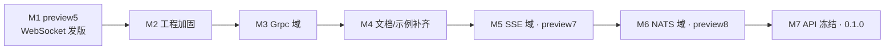

# Observables 路线图

本文件描述 Observables 从预览版走向 **`0.1.0` 稳定版** 的里程碑规划。它是规划层文档：每个里程碑的工程标准（中央包管理、警告策略、诊断治理等）以 [`AGENTS.md`](../AGENTS.md) 为权威，本文件只排序与拆解。

> 版本号、tag、发版均须维护者明确批准；本文件中的版本号（如 `preview5`）为规划占位，不构成自动发版授权。

## 现状基线（`0.1.1` 已发 nuget.org）

| 维度 | 现状 |
|------|------|
| 已实现域 | **Events**、**RestAPI**、**SignalR**、**Mqtt**、**WebSocket**、**Grpc**、**Sse**、**Nats**（运行时 + 双路生成器 + 测试） |
| 共享层 | `Observables.Core`、`Observables.SourceGenerators.Shared`、`Observables.CodeFixes`、`Observables.Analyzers` |
| nuget.org 已发 | **`0.1.0-preview6`** — **12 包**；**`0.1.0-preview7`** — **14 包**（+ Sse）；**`0.1.0-preview8`** — **16 包**（+ Nats）；**`0.1.0`** — **16 包**（稳定版）；**`0.1.1-preview1`** — 本地化 IntelliSense 预览；**`0.1.1`** — **16 包**（稳定版，`v0.1.1` tag + GitHub Release） |
| 构建 | 主仓 Nuke `Ci` / `CiPack` / `Publish`；`PackVerify` + `eng/nuget-smoke`（**16** 消费者） |
| 示例仓 CI | `Observables.Samples` Nuke `Ci`（NuGet `0.1.1`，已同步） |

### 已知工程债（详见 AGENTS.md「工程治理」）

| # | 项 | 状态 |
|---|-----|------|
| 1 | 中央包管理（`Directory.Packages.props`） | ✅ M2 已落地 |
| 2 | TFM / 公共属性收口（`eng/Observables.ProjectDefaults.props`） | ✅ M2 已落地 |
| 3 | `TreatWarningsAsErrors`；CS860x、IL trim、xUnit 告警 | ✅ M2/M7 已落地（域运行时 net8/9 通过 Requires* 传播与生成代理保留收敛 IL 告警） |
| 4 | Nuke 清单 / 版本双真相源 | ✅ M2 已落地（`Observables.BuildManifest.json` + `PackageVersionReader`） |
| 5 | 诊断 release 跟踪（`AnalyzerReleases.*.md`、移除 RS2008） | ✅ M2 已落地；描述符文件结构仍分散 |
| 6 | Grpc 骨架命名（`Observables.Grpc.R3`）违反约定 | ✅ M3 已重命名为 `*.R3.SourceGenerators` |
| 7 | 文档滞后：README / Docs / Samples | ✅ M4 已补齐（含 Grpc 用户文档与 Samples） |
| 8 | Samples `RestAPI.Reactive` 显式 `R3` 触发 OBS0001 | ✅ `R3` 改为 runtime-only（`ExcludeAssets=compile`） |

## 诊断 ID 段分配（权威）

| 段 | 域 | 状态 |
|----|----|------|
| `OBS0001` | Shared（包冲突等全库诊断） | 使用中 |
| `OBS2001`–`OBS2999` | Events | 使用中（2001–2004） |
| `OBS3001`–`OBS3999` | RestAPI | 使用中（3001–3005） |
| `OBS4001`–`OBS4999` | SignalR | 使用中（4001–4007） |
| `OBS5001`–`OBS5999` | Mqtt | 使用中（5001–5007） |
| `OBS6001`–`OBS6999` | WebSocket | 使用中（6001–6007） |
| `OBS7001`–`OBS7999` | Grpc | 使用中（7001–7007） |
| `OBS8001`–`OBS8999` | SSE | 使用中（8001–8007） |
| `OBS9001`–`OBS9999` | NATS | 使用中（9001–9007，M6） |

新增诊断须落入对应段并在 `AnalyzerReleases.Unshipped.md` 登记（见 AGENTS.md）。

## 里程碑

里程碑按依赖排序；M1 与 M2 可并行启动。**策略：先扩域、后冻结 1.0** —— 在 `0.1.x` 预览期内先把 SSE（M5）与 NATS（M6）补齐为完整域，待目标域全部就位后再一次性冻结公共 API 并发 1.0（M7）。M7 的 API 冻结依赖 M1–M6 全部完成。

### M1 — `preview5`：WebSocket 发版 ✅

已于 `v0.1.0-preview5` tag 发布至 nuget.org 与 GitHub Packages。

- ~~发布 `Observables.WebSocket.R3` 与 `Observables.WebSocket.Reactive`（共 **10 包**）。~~ ✅
- ~~同步主仓 [`README.md`](../README.md) 域状态表与预览包清单。~~ ✅
- ~~新增 Docs `websocket.md`（中英），来源参考 [`docs/design/websocket.md`](design/websocket.md)。~~ ✅
- ~~新增 Samples `Observables.Samples.WebSocket`。~~ ✅
- ~~出口校验：`Ci` + `CiPack` 绿、WebSocket smoke 消费者通过。~~ ✅

### M2 — 工程加固 ✅

把上文「已知工程债 1–5」收敛到 AGENTS.md 定义的标准态。每条作为独立 PR：

- ~~引入 `Directory.Packages.props`~~ ✅
- ~~`eng/Observables.ProjectDefaults.props` 收口 TFM / 公共属性~~ ✅
- ~~`eng/Observables.BuildManifest.json` + `PackageVersionReader`~~ ✅
- ~~`AnalyzerReleases.Shipped.md` / `Unshipped.md`，移除 RS2008 pragma~~ ✅
- ~~`TreatWarningsAsErrors` + CS86xx / xUnit1051 清零~~ ✅；域运行时 net8/9 IL trim 告警通过 Requires* 传播与 `DynamicDependency` 生成代理保留收敛（M7）。

### M3 — Grpc 域 ✅

按 AGENTS.md「新增 Feature 检查清单」从骨架建成完整域（PR #77，已合并 `main`）：

- ~~新增设计文档 `docs/design/grpc.md`（unary / server-streaming / 双向流到反应式流的映射）。~~ ✅
- ~~重命名骨架：`Observables.Grpc.R3` → `Observables.Grpc.R3.SourceGenerators`，补 `Observables.Grpc.Reactive.SourceGenerators`、`Observables.Grpc.SourceGenerators.Shared`。~~ ✅
- ~~启用 `OBS7xxx` 诊断段（7001–7007）。~~ ✅
- ~~建 `Observables.Grpc.Package`，产出 `Observables.Grpc.R3` / `Observables.Grpc.Reactive` 两包。~~ ✅
- ~~补生成器测试 + E2E + smoke 消费者，纳入 `PackVerify`（manifest **12 包**）。~~ ✅

Grpc 两包已于 **`0.1.0`**（`v0.1.0-preview6` tag）发布至 nuget.org 与 GitHub Packages。

### M4 — 文档与示例补齐 ✅

- ~~统一诊断登记文档（OBS0001 / 2xxx–7xxx）到 Docs `diagnostics.md`~~ ✅
- ~~Docs（中英）`grpc.md`；Samples `Observables.Samples.Grpc`~~ ✅
- ~~校验 README、Docs、Samples 三处域状态与 `0.1.0` 一致~~ ✅
- ~~发版后复核 nuget.org 包页链接与站点 `npm run docs:build`~~ ✅（M4 收尾 PR）

### M5 — SSE 域（`preview7`） ✅

**目标**：补全「HTTP 单向流」边界（RestAPI 为 req/resp、WebSocket 为双工，SSE 居中）。形态为纯消费流，是 `IObservable` 的典型场景；接口面与 SignalR 的 `[HubOn]` 同构，工程骨架以 **WebSocket 域**为模板。

按 AGENTS.md「新增 Feature 检查清单」从零建成完整域：

- 新增设计文档 `docs/design/sse.md`（`text/event-stream` 解析、重连 / `Last-Event-ID`、事件名路由到反应式流的映射）。
- 建 `Observables.Sse`（运行时，复用 `HttpClient`；解析参考 RestAPI）、`Observables.Sse.SourceGenerators.Shared`、`Observables.Sse.R3.SourceGenerators`、`Observables.Sse.Reactive.SourceGenerators`。
- 公共面草案：`[Sse]` 接口 + `[SseEvent("name")]` 属性 → `Observable<T>` / `IObservable<T>`；入口 `SseService.For<T>(...)`。
- 启用 `OBS8xxx` 诊断段（生成器 8001–8006 + 空代理接口 analyzer `OBS8007`，与各域 `*007` 一致）；在 `ProxyDomainCatalog` 登记 Sse 域。
- 建 `Observables.Sse.Package`，产出 `Observables.Sse.R3` / `Observables.Sse.Reactive` 两包；登记 `eng/Observables.BuildManifest.json`（→ **14 包**）。
- 补生成器测试 + E2E（内嵌 HTTP server 推送事件流）+ smoke 消费者，纳入 `PackVerify`。
- 同步三处文档：README 域状态、Docs（中英）`sse.md` + `diagnostics.md`、Samples `Observables.Samples.Sse`（+ `.Reactive`，RegistrationDemo）。

### M6 — NATS 域（`preview8`） ✅

**目标**：引入 Core NATS subject 代理（Subscribe / Publish / Request-Reply）。结构与 Mqtt 同构；JetStream 仅设计 follow-up。

- 新增设计文档 `docs/design/nats.md` ✅
- 建 `Observables.Nats` 运行时 + Shared/R3/Reactive 生成器 ✅
- 公共面：`[Nats]` + `[NatsSubscribe]` / `[NatsPublish]` / `[NatsRequest]`；`NatsService.For<T>(INatsConnection)` ✅
- 启用 `OBS9xxx`（9001–9007）；`ProxyDomainCatalog` 登记 Nats ✅
- 建 `Observables.Nats.Package`；manifest → **16 包** ✅
- 生成器测试 + E2E（进程内 nats-server）+ smoke 消费者 ✅
- 同步 Docs / Samples / README / AGENTS ✅

> M5/M6 为预览期内的新增域，每个域遵循「发版门槛清单」与「新增 Feature 检查清单」；版本号与 tag 仍须维护者明确批准。

### M7 — API 冻结与 `0.1.0` ✅

> 依赖 M1–M6 全部完成（八域齐备后再冻结）。

- 引入 `Microsoft.CodeAnalysis.PublicApiAnalyzers`，为运行时与公共 Attribute 锁定公共 API（`PublicAPI.Shipped.txt` / `Unshipped.txt`）。✅ 见 [`docs/design/public-api.md`](design/public-api.md)。
- nullable / AOT / trim 告警清零（M7 已通过 Requires* 传播与生成代理保留收敛域运行时 IL 告警；`JsonSerializerContext` source-gen 为后续增强）。✅
- 复核包元数据（README、tags、license、SourceLink）。✅
- 维护者推 `v0.1.0` tag → NuGet → GitHub Release（稳定版含 Release，预览版不含）。

## 发版门槛清单（每次 preview / 稳定版）

发布前须全部满足：

1. `dotnet run --project build/_build.csproj -- --target Ci` 通过。
2. `--target CiPack`（含 `PackVerify`）通过，`ExpectedPackageIds` 与实际产物一致。
3. `eng/nuget-smoke` 全部消费者编译/运行通过。
4. `eng/Observables.Package.props` 的 `Version` 与待推 tag 一致（唯一版本来源）。
5. 主仓 README、Observables.Docs、Observables.Samples 三处域状态与版本同步。
6. 预览版仅 tag + NuGet；稳定版额外由维护者建 GitHub Release。

## 版本节奏（规划占位，非授权）

| 版本 | 关联里程碑 |
|------|------------|
| `0.1.0-preview5` | M1（10 包，nuget.org） |
| `0.1.0` | M3 Grpc 发版（**12 包**，nuget.org） |
| `0.1.0-preview7` | M5 SSE 域（**14 包**） |
| `0.1.0-preview8` | M6 NATS 域（**16 包**） |
| `0.1.0` | M7（八域 API 冻结，**16 包**稳定版） |
| `0.1.1-preview1` | 八域 + Reactive **zh-Hans IntelliSense** 预览 |
| `0.1.1` | 本地化文档稳定版（**16 包**） |
