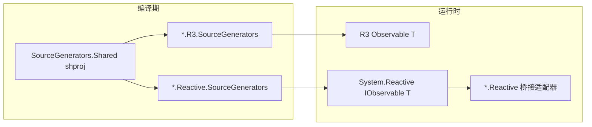

# 架构总览

> 面向维护者与贡献者。操作清单见 [`AGENTS.md`](../../AGENTS.md)；文档体系见 [`DOCUMENTATION.md`](../DOCUMENTATION.md)。

## 1. 工作区与仓库

```
Skymly/Observables/                 # 工作区根（非 git 根）
├── Observables/                    # 主仓 — 生成器、运行时、CI、维护者 docs/
├── Observables.Docs/               # VitePress 用户文档（英 + zh）
└── Observables.Samples/              # 16 个示例项目（消费 NuGet）
```

| 仓库 | 受众 | 语言 |
|------|------|------|
| Observables | 维护者、CI、NuGet 产物 | 代码英文；`docs/` 中文为主 |
| Observables.Docs | 库使用者 | 英文 + `docs/zh/` |
| Observables.Samples | 学习与 smoke 参考 | README 英文 |

用户可见变更须**三仓同步**（见 `AGENTS.md` §8）。

## 2. 功能域模型

每个 **Feature（域）** 对应解决方案文件夹 `Observables.<Feature>/`，通常包含：

```
Observables.<Feature>/
├── Observables.<Feature>/              # 域运行时（Events 除外，仅 props）
├── Observables.<Feature>.Reactive/     # IObservable 桥接（按需）
├── Observables.<Feature>.SourceGenerators.Shared/   # shproj，#if DOMAIN_R3 双后端
├── Observables.<Feature>.R3.SourceGenerators/
├── Observables.<Feature>.Reactive.SourceGenerators/
├── Observables.<Feature>.Package/      # 产出 .R3 + .Reactive 两个 NuGet 包
└── *Tests / *SourceGenerators.Tests
```

**Events 例外**：无双后端 shproj；R3 与 Reactive 各一套生成器源码，诊断 OBS2xxx 在域内 `DiagnosticDescriptors.cs`。

**NuGet 面**：每域仅两个包 ID — `Observables.<Feature>.R3`、`Observables.<Feature>.Reactive`（共 16 包）。

## 3. 双后端（R3 / System.Reactive）



| 维度 | R3 路径 | Reactive 路径 |
|------|---------|---------------|
| 生成器常量 | `#if OBSERVABLES_R3`（`Observables.SourceGenerators.R3.props`）+ 域级 `#if DOMAIN_R3`（BridgeType 等） | `ObservablesReactiveBackend=SystemReactive`（无 `OBSERVABLES_R3`） |
| 共享 backend tokens | `BackendTokens`（`Observable`/`Unit` 元数据名、`IsR3`、`QualifyGeneratedNamespace`） | 同上，编译进 Reactive 生成器时走 `#else` 分支 |
| 生成返回类型 | `Observable<T>` | `IObservable<T>` |
| 运行时依赖 | `R3` 包 | `System.Reactive` + 域 `.Reactive` 桥接 |
| 禁止 | R3 包引用 System.Reactive | Reactive 包引用 R3 |

共享生成逻辑放在 `*.SourceGenerators.Shared`（`.projitems`），由两路生成器项目 Import；全库基础设施在 `Observables.Shared/Observables.SourceGenerators.Shared`（`BackendTokens`、`GeneratedSourceHeader`、`GeneratorFailSafe`、`DiagnosticHelpLink` 等），经 `Observables.SourceGenerators.SharedSource.props` 链接编译。IO 代理域 Parser 经 `BackendTokens` 读编译期后端；域特定 BridgeType / adapter 元数据仍留在各域 Emitter/Parser。

## 4. 源生成器管道（IO 域典型）

以 SignalR / RestAPI 等 **接口代理** 域为例：

1. **SyntaxProvider / ForAttribute**：收集带边界特性的接口声明。
2. **Parser**：符号模型 → `HubInterfaceModel` 等（含 `Nullability`、诊断）。
3. **IncrementalValuesProvider**：`ReportDiagnostics` → `Build*` → `EmitSource` / `EmitModuleInitializers`。
4. **Emitter**：`GeneratedSourceHeader` 前缀 + 代理类 + `ModuleInitializer` 工厂注册。
5. **Fail-safe**：`GeneratorFailSafe.ExecuteParse` / `TryEmit`；内部错误 → `OBS*008`（或 Events `OBS2005`）。

**Events 域**走调用点驱动（`.Events()` 等），管道见 [design/events.md](events.md) §4。

## 5. 分析器与 CodeFix

| 组件 | 程序集 | 分发 |
|------|--------|------|
| `Observables.Analyzers` | 独立分析器 | 随各 `.Package` 的 analyzer 文件夹 |
| `Observables.CodeFixes` | CodeFix / 补全 | 同上 |
| 域生成器诊断 | 各 `*.SourceGenerators` | 同上 |

共享诊断：`OBS0001`（R3+Reactive 同域冲突）、`OBS*007`（空代理接口，按域分类）。

## 6. 构建与 CI

- **Nuke**（`build/Program.cs`）：`Ci` → 域矩阵测试；`PackVerify` → 16 包结构断言；`Publish` → tag 触发。
- **清单**：`eng/Observables.BuildManifest.json`（pack / test / smoke 单一真相源）。
- **CI 增量**：`dorny/paths-filter` — Shared 改动跑全域；单域改动只跑该域 test/pack job。
- **Smoke**：`eng/nuget-smoke/<Feature>.{R3,Reactive}.Consumer` 用本地 nupkg 验证引用链。

## 7. 版本与发版

- 版本单一来源：`eng/Observables.Package.props` 的 `PackageVersion`。
- Tag `v*` 触发 `release.yml` → Nuke `Publish`（nuget.org + GitHub Packages）。
- 稳定版另建 GitHub Release；预览版仅 tag + NuGet。

## 8. 相关文档

- [contributor.md](contributor.md) — 新增域步骤（人类向）
- [public-api.md](public-api.md) — Public API 分析器
- [events.md](events.md) — Events 域设计文档（含 API 面、诊断表、生成器管道）
- [ROADMAP.md](../ROADMAP.md) — 里程碑与 backlog
